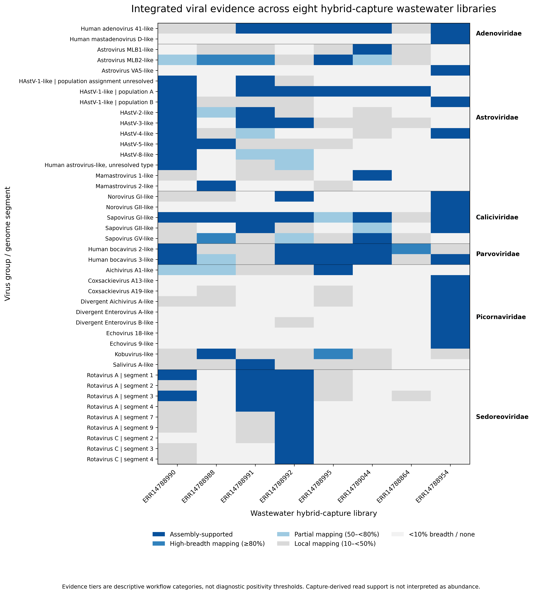

# Wastewater Hybrid-Capture Viromics

A reproducible workflow for **target-enriched wastewater viromics**, integrating de novo viral discovery, assembly-supported detection, competitive mapping, sequence annotation, multisample evidence integration, genome reconstruction, phylogenetic analysis, and diagnostic oligonucleotide mismatch surveillance.

The project uses publicly available hybrid-capture wastewater sequencing data from **ENA project PRJEB87273** and was developed as a reproducible computational portfolio for wastewater viral metagenomics.

---

## Overview

Hybrid-capture sequencing can substantially increase sequencing support for targeted viral genomes in wastewater, but enrichment also introduces important analytical considerations.

This workflow therefore combines complementary evidence from:

- putative PCR duplicate removal;
- read quality control and human-read removal;
- de novo metagenomic assembly;
- viral classification with geNomad;
- target-family filtering;
- assembly-supported read-back;
- within-family sequence clustering;
- local viral nucleotide annotation;
- competitive multisample read mapping;
- taxonomy reconciliation;
- biological-group evidence integration;
- reference-guided consensus reconstruction;
- genotype and phylogenetic placement;
- in-silico diagnostic primer/probe mismatch surveillance.

The automated **Snakemake multisample workflow** runs from raw paired-end reads through the final portfolio evidence heatmap.

```text
FASTQ
  │
  ├── Putative PCR duplicate removal
  │
  ├── QC / trimming
  │
  ├── Human-read removal
  │
  ├── De novo assembly
  │
  ├── geNomad viral classification
  │
  ├── Strict target-family extraction
  │
  ├── Assembly-supported read-back
  │
  └── Per-sample supported viral contigs
          │
          ├── Multisample supported-contig pool
          │
          ├── Within-family sequence clustering
          │
          ├── Representative-sequence extraction
          │
          ├── nt_viruses annotation
          │     ├── megablast
          │     └── sensitive blastn follow-up
          │
          ├── Competitive all-cluster mapping
          │
          ├── Taxonomy reconciliation
          │
          ├── Biological grouping
          │
          ├── Cross-sample evidence integration
          │
          └── Portfolio evidence heatmap
```

A complementary **single-sample deep-dive branch** performs reference-guided consensus reconstruction, astrovirus typing / phylogenetic placement, and diagnostic primer/probe mismatch analysis.

---

## Dataset

The workflow uses hybrid-capture wastewater libraries from:

- **ENA project:** `PRJEB87273`
- **Study:** Global urban virome
- **Capture panel:** GastroCap
- **Sequencing:** paired-end Illumina sequencing

The multisample analysis includes eight capture libraries:

| Run | Sample | Raw read pairs |
|---|---|---:|
| `ERR14788990` | RD-370 | 199,495 |
| `ERR14788988` | RD-304 | 345,630 |
| `ERR14788991` | RD-387 | 206,004 |
| `ERR14788992` | RD-398 | 349,193 |
| `ERR14788995` | RD-462 | 180,575 |
| `ERR14789044` | FI-OU-438 | 96,959 |
| `ERR14788864` | PL-PL-106 | 374,402 |
| `ERR14788954` | CM1802 | 1,200,895 |

The anchor sample used for detailed genome reconstruction is:

| Field | Value |
|---|---|
| Run | `ERR14788990` |
| Sample | RD-370 |
| Location | Copenhagen, Denmark |
| Collection date | 2018-03-01 |
| Raw read pairs | 199,495 |

Raw sequencing data are publicly available through ENA and are **not redistributed in this repository**.

---

## Target viral families

The target-family screening step focuses on the viral families represented in the GastroCap enrichment design:

- Adenoviridae
- Astroviridae
- Caliciviridae
- Hepeviridae
- Parvoviridae
- Picornaviridae
- Sedoreoviridae
- Spinareoviridae

The proprietary GastroCap capture-probe sequences are not publicly available and are **not analyzed in this repository**.

---

# Multisample workflow

## 1. Putative PCR duplicate removal

Raw paired-end reads are deduplicated with **CD-HIT-DUP** before read trimming.

A paired-read sequence-prefix criterion is used to remove duplicated read pairs.

Because the sequencing libraries do not contain unique molecular identifiers (UMIs), removed reads are described as:

> **putative PCR duplicates**

rather than experimentally verified molecular duplicates.

---

## 2. Read quality control

Deduplicated reads are processed using **fastp**.

The workflow applies quality trimming and filtering before host-read removal.

Formal preprocessing follows:

```text
raw reads
→ putative PCR deduplication
→ fastp
→ human-read removal
```

---

## 3. Human-read removal

Quality-controlled reads are mapped against the human **GRCh38** reference using Bowtie2.

Only paired reads remaining nonhuman are retained for downstream assembly and viral analysis.

Across the eight analyzed libraries, human alignment was negligible under the validated workflow.

---

## 4. De novo assembly

Nonhuman paired-end reads are assembled independently with **MEGAHIT**.

Contigs ≥1 kb are retained for downstream viral classification.

This preserves an assembly-first viral-discovery component rather than relying exclusively on reference mapping.

---

## 5. Viral classification

Contigs ≥1 kb are screened with **geNomad**.

The validated workflow uses the pinned image:

```text
community.wave.seqera.io/library/genomad:1.12.0--27836e6e665e84b5
```

Contigs assigned to the target viral families are retained for downstream analysis.

Across the eight samples, this produced:

- **237 strict target-family viral contigs**

---

## 6. Assembly-supported read-back

Candidate viral contigs are mapped back against the corresponding nonhuman reads.

The formal assembly-supported high-confidence criterion is:

```text
breadth ≥ 95%
AND
mean depth ≥ 10×
```

Using this criterion:

- **136 contigs** were supported across the eight libraries.

This step is described as an:

> **assembly-supported high-confidence detection criterion**

It is not treated as an independent validation experiment.

---

## 7. Within-family sequence clustering

The 136 supported target contigs are pooled across samples and clustered **within viral families** using CD-HIT-EST.

Clustering uses:

```text
95% nucleotide identity
80% shorter-sequence coverage
reverse-complement matching enabled
```

The analysis produced:

- **136 supported contigs**
- **96 sequence clusters**

These clusters are used for sequence dereplication and competitive mapping.

**The 96 sequence clusters should not be interpreted as 96 viral species or 96 individual viruses.**

---

## 8. Viral nucleotide annotation

One representative sequence from each cluster is compared against a local NCBI viral nucleotide database.

The annotation workflow uses:

```text
megablast
→ annotation triage
→ sensitive blastn for non-strong matches
```

All 96 cluster representatives obtained interpretable viral nucleotide matches under the final workflow.

Annotation confidence labels such as `strong` and `moderate` are **workflow triage categories**, not formal species or genotype thresholds.

---

## 9. Competitive all-cluster mapping

All cluster representatives are combined into a competitive reference panel.

Reads from each sample are mapped against the complete panel using Bowtie2.

Mapping evidence is summarized using:

- properly paired fragments;
- MAPQ ≥20 reads;
- breadth ≥1×;
- breadth ≥10×;
- mean depth;
- fragments per million input fragments (FPM).

FPM is interpreted as:

> **normalized sequencing support**

and **not as unbiased viral abundance**, because hybrid capture alters relative read representation.

---

## 10. Evidence tiers

For each sequence cluster and sample, evidence is summarized descriptively.

The workflow distinguishes:

```text
ASSEMBLY
HIGH_BREADTH_MAPPING
PARTIAL_MAPPING
LOCAL_MAPPING
NONE
```

These categories describe the strength and distribution of sequencing evidence.

They are **not diagnostic positivity thresholds**.

---

## 11. Taxonomy reconciliation

geNomad family assignments are retained alongside nucleotide-reference evidence.

Where strong nucleotide evidence conflicts with the original geNomad family classification, both the original and reconciled classifications are preserved.

For example, several contigs originally assigned to Picornaviridae were reconciled to Caliciviridae after strong nucleotide matches to sapovirus or norovirus sequences.

This preserves the distinction between:

- original computational classification;
- reference-based taxonomic interpretation.

---

## 12. Biological grouping

Closely related sequence clusters are subsequently organized into biologically interpretable groups or genome segments.

The full analysis produced:

- **51 biological groups / genome segments**

These groups are analytical units for cross-sample evidence integration.

They should **not be interpreted directly as viral richness**.

---

## 13. Portfolio evidence matrix

Nine reference-like or unresolved biological groups were removed from the presentation-focused matrix because they were not central to interpretation of the human enteric viral signal.

The final portfolio matrix contains:

- **42 biological groups / segments**
- **8 wastewater capture libraries**

The full underlying evidence tables remain available in `results_summary/`.

---

## Multisample evidence heatmap

The main portfolio output summarizes assembly and mapping evidence across the eight capture libraries.



Evidence colors represent discrete evidence categories rather than continuous abundance.

---

# Single-sample genome reconstruction

The anchor library `ERR14788990` was additionally used for deeper sequence reconstruction and interpretation.

The single-sample branch includes:

```text
target detection
→ reference selection
→ independent reference mapping
→ consensus reconstruction
→ genotype / phylogenetic analysis
→ diagnostic primer/probe mismatch analysis
```

---

## Reference-guided viral recovery

Several human enteric viral targets showed strong reference-guided support.

| Target | Reference | Callable sequence | Mean depth | Interpretation |
|---|---|---:|---:|---|
| HAstV-1 population A | `LC694990.1` | 98.92% | 397.9× | Near-complete consensus |
| HAstV-1 population B | `LC694997.1` | 47.84% | 21.6× | Partial divergent population |
| HAstV-3 | `MN444721.1` | 99.96% | 255.6× | Near-complete consensus |
| Rotavirus A segment 3 | `OR890193.1` | 83.64% | 32.4× | Partial high-confidence segment consensus |

---

## Two HAstV-1 sequence populations

Independent assembly, competitive mapping, reference-guided reconstruction, and ORF2 phylogenetic analysis supported:

> **two phylogenetically distinct HAstV-1 sequence populations**

The terminology `population A` and `population B` is used as an analysis label and does not imply an official lineage designation.

Two assembled contigs showed reciprocal reference specificity:

| Contig | HAstV1_A identity | HAstV1_B identity |
|---|---:|---:|
| `k141_843` | 99.08% | 88.97% |
| `k141_1995` | 90.56% | 99.64% |

The reconstructed HAstV-1 ORF2 sequences shared approximately:

- **1,997 comparable nucleotide sites**
- **1,802 matches**
- **90.24% nucleotide identity**

Population A was nearly completely reconstructed, whereas population B showed lower sequencing support and partial reconstruction.

---

## HAstV-3 reconstruction

The HAstV-3 consensus showed:

- reference length: **6,790 bp**
- callable sequence: **99.96%**
- masked positions: **3 bp**
- mean depth: **255.6×**
- high-confidence reference-relative SNPs: **15**

The reconstructed ORF2 sequence showed approximately **99.75% nucleotide identity** to `MN444721.1`.

Phylogenetic placement supported classification as HAstV-3.

---

## Rotavirus A segment 3

Rotavirus A segment 3 showed:

- reference length: **2,591 bp**
- breadth ≥1×: **97.61%**
- breadth ≥10×: **83.64%**
- mean depth: **32.42×**
- callable sequence: **83.64%**
- masked positions: **424 bp**

The sequence is therefore interpreted as a **partial high-confidence segment consensus**, rather than a near-complete segment reconstruction.

---

## Phylogenetic analysis

Classical human astrovirus typing focuses on the **ORF2 capsid region**.

Sample and public reference sequences were aligned using MAFFT, followed by exploratory phylogenetic analysis with FastTree.

FastTree node-support values are treated as **local support values**, not conventional bootstrap percentages.

---

# Diagnostic oligonucleotide mismatch surveillance

Published classical human astrovirus diagnostic RT-qPCR primer/probe sequences were compared in silico against reconstructed viral sequences.

The analysis distinguishes:

- internal primer mismatches;
- primer 3′-terminal mismatches;
- probe mismatches;
- uncallable consensus positions.

This analysis evaluates:

> **in-silico sequence compatibility**

and does not establish experimental PCR sensitivity, amplification efficiency, or diagnostic assay failure.

No proprietary GastroCap capture-bait sequence is included in this analysis.

---

## Example diagnostic compatibility results

| Sample | Assay | Forward mismatches | Reverse mismatches | Probe mismatches | Primer 3′ mismatches |
|---|---|---:|---:|---:|---:|
| HAstV1_A | BCCDC classical HAstV | 1 | 0 | 1 | 0 |
| HAstV1_A | Classic HAstV Japan | 1 | 0 | 0 | 0 |
| HAstV1_B | BCCDC classical HAstV | 1 | 0 | 0 | 0 |
| HAstV1_B | Classic HAstV Japan | 0 | 0 | 0 | 0 |
| HAstV3 | BCCDC classical HAstV | 1 | 0 | 2 | 0 |
| HAstV3 | Classic HAstV Japan | 0 | 1 | 0 | 0 |

No primer 3′-terminal mismatches were observed in the evaluated sequences.

These results illustrate that overall genome divergence does not necessarily predict divergence at diagnostic oligonucleotide binding sites.

---

# Reproducible execution

The main multisample workflow is orchestrated with **Snakemake**.

The validated workflow used:

```text
Snakemake 7.32.4
```

Software versions are documented in:

```text
docs/software_versions.md
```

Environment and database requirements are described in:

```text
docs/environment.md
```

A reference plotting environment is provided in:

```text
workflow/envs/plotting.yaml
```

---

## Quick start

Clone the repository:

```bash
git clone https://github.com/qihuang627-creator/wastewater-capture-viromics.git
cd wastewater-capture-viromics
```

Install or configure the required external software and databases described in:

```text
docs/environment.md
```

Inspect the workflow without executing jobs:

```bash
snakemake \
  --cores 8 \
  --dry-run \
  --rerun-triggers mtime
```

Run the workflow:

```bash
snakemake \
  --cores 8 \
  --rerun-triggers mtime
```

If the default Python interpreter does not contain the required plotting packages, specify a compatible interpreter:

```bash
export PLOT_PYTHON=/path/to/python

snakemake \
  --cores 8 \
  --rerun-triggers mtime
```

---

## Reproducibility validation

The completed Snakemake DAG was tested by deliberately deleting the final portfolio matrix and heatmap outputs and allowing Snakemake to regenerate them.

The regenerated:

- TSV matrix was **byte-identical** to the original;
- PNG heatmap was **byte-identical** to the original;
- PDF had different binary metadata but **identical rendered content**.

This validates dependency tracking through the final presentation-level output.

---

# Repository structure

```text
.
├── README.md
├── Snakefile
├── LICENSE
├── CITATION.cff
├── .gitignore
│
├── config/
│   └── multisample/
│       ├── samples.tsv
│       ├── workflow.yaml
│       └── run_lists/
│
├── metadata/
│   └── single_sample/
│
├── scripts/
│   ├── single_sample/
│   └── multisample/
│
├── refs/
│   ├── common/
│   ├── single_sample/
│   └── multisample/
│
├── results_summary/
│   └── multisample/
│
├── figures/
│   └── multisample/
│
├── docs/
│   ├── environment.md
│   └── software_versions.md
│
└── workflow/
    └── envs/
        └── plotting.yaml
```

Large raw sequencing files, reference databases, alignment files, QC outputs, and intermediate analysis directories are intentionally excluded from version control.

---

# Key output files

Important multisample outputs include:

```text
results_summary/multisample/supported_target_contigs.tsv
results_summary/multisample/supported_sequence_clusters.tsv
results_summary/multisample/all96_annotation_master.tsv
results_summary/multisample/all96_annotation_reconciled.tsv
results_summary/multisample/all96_evidence_master.tsv
results_summary/multisample/biological_group_evidence_matrix.tsv
results_summary/multisample/portfolio_enteric_group_matrix.tsv
```

Main figure:

```text
figures/multisample/portfolio_enteric_evidence_heatmap.png
```

---

# Interpretation cautions

Several aspects of the workflow are intentionally described conservatively.

1. **Duplicate removal**

   Without UMIs, duplicate reads are described as *putative PCR duplicates*.

2. **Assembly-supported detection**

   Read-back support is an assembly-supported high-confidence criterion, not an independent validation experiment.

3. **Capture sequencing**

   Hybrid enrichment alters read representation. FPM therefore represents normalized sequencing support rather than unbiased viral abundance.

4. **Sequence clusters**

   The 96 within-family sequence clusters are dereplication units and should not be interpreted as 96 viral species.

5. **Biological groups**

   The 51 biological groups / genome segments are analytical units and should not be interpreted directly as viral richness.

6. **Evidence tiers**

   Evidence categories are descriptive and are not clinical or diagnostic positivity thresholds.

7. **Reference host names**

   Viral reference titles containing host terms such as rodent, canine, or porcine do not by themselves establish the biological host origin of wastewater sequences.

8. **Phylogenetic support**

   FastTree support values are local support values rather than conventional bootstrap percentages.

9. **Diagnostic mismatch analysis**

   Primer/probe mismatch analysis evaluates sequence compatibility only and does not establish experimental assay performance.

10. **Capture probes**

    Proprietary GastroCap probe sequences are not publicly available and are not evaluated in this repository.

---

# Software

Major tools used in the validated analysis include:

- Snakemake
- CD-HIT-DUP
- fastp
- Bowtie2
- SAMtools
- MEGAHIT
- geNomad
- CD-HIT-EST
- NCBI BLAST+
- MAFFT
- FastTree
- bcftools
- Python
- matplotlib
- NumPy

Exact versions used in the validated workflow are listed in:

[`docs/software_versions.md`](docs/software_versions.md)

---

# License

This repository is released under the **MIT License**.

See [`LICENSE`](LICENSE).

---

# Citation

Citation information for this repository is provided in:

[`CITATION.cff`](CITATION.cff)

---

# Author

**Qi Huang, PhD**

Environmental biotechnology · wastewater viromics · microbial ecology · multi-omics · data-driven environmental bioprocesses
